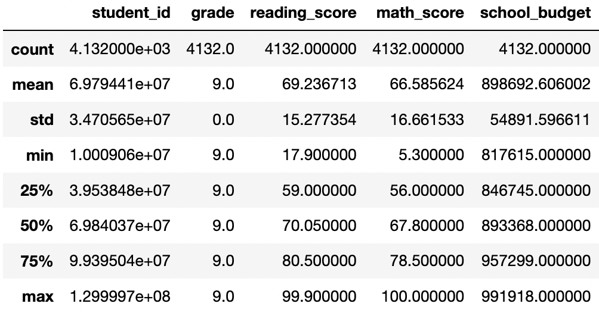

# School District Analysis: PyCity Schools

## Overview: Background, Purpose and Process

For the analysis for the school district, PyCity Schools, our task was to help Maria analyze different information in a csv file regarding standardized testing. Our specific tasks were to look at the students' math and reading scores to find trends in the data. 

In order to complete these tasks, we first had to collect the data using Python, Jupyter Notebook and Pandas. Next, we prepared the data by checking for missing NAN values and duplicated rows. After removing these rows, we had to make sure the grade variable was changed to an integer type so we could perform analysis using the different math functions in Pandas. We then had to drill down into the data by using our loc and iloc functions to find specific summary statistics for specific grades and schools in our district. Lastly, we compared the data for the school budget by using the groupby and mean functions. 

## Resources 
- Data Source: new_full_student_data.csv
- Software: Python 3.9.12, Anaconda 4.14.0, Jupyter Notebook 6.4.8 , and Pandas

## Summary Statistics and Analysis

Below is the table for the summary statistics for Grade 9. 

From the process of cleaning, prepping and analyzing the data, we can conclude: 

- As a district, the mean reading score is 72.4% and the average math score is 64.7%. 
- The average school budget is approximately $893,742.75.
- We can see the comparison in reading and math scores for each school.
- The average reading score for all students in Grade 11 and 12 is 75%.
- Charter schools' budget ($872,625) is slightly lower than Public schools' budget ($911,195). 
- Montgomery, Green and Dixon High School have the largest populations of students. 
- Lastly, we see that Public school students have a lower average math score than students who attend Charter schools. 

